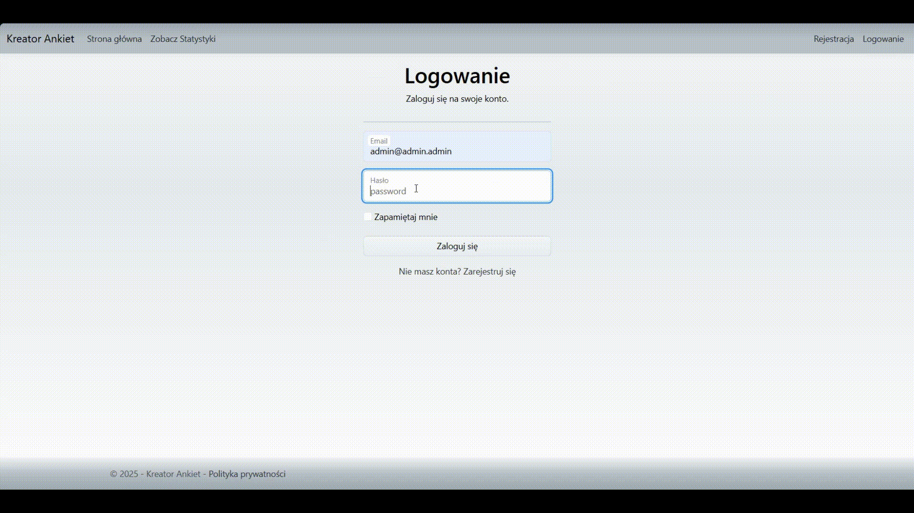

## [ENG] – Survey Management System

It is a simple web application for managing surveys — administrators can create surveys, and users can fill them out. The app also provides statistics, which can be filtered by age and location of respondents. The application is now fully containerized using **Docker**, and the database runs on **PostgreSQL**.

### Project Preview
You can try the application live here: [Survey Manager](https://surveys-manager.onrender.com)

You can log in using the default administrator account:

**Login:** admin@admin.admin 
**Password:** Admin123!

### Technologies
- **C#**
- **ASP.NET**
- **Entity Framework**
- **ASP.NET Identity**
- **PostgreSQL (running in Docker)**

### How it works

**Users and roles**
- The application has a registration and login system based on **ASP.NET Identity**,
- Two roles exist:
  - **Administrator** – manages surveys and has full access to statistics,
  - **User** – can fill out surveys and view results,
- Access to features depends on the user role.

**Surveys**
- Surveys are created by the administrator,
- Users can fill out available surveys online,
- Responses are stored in a **PostgreSQL** relational database.

**Statistics**
- Statistics are available for all users,
- Results can be filtered by:
  - **Location**,
  - **Age** of respondents,
- The goal was to demonstrate practical use of database queries in a web application.

**Database**
- Application now uses **PostgreSQL**, running inside a Docker container,
- All user and survey data are handled via **Entity Framework**.

### Project goal
The goal of the project was to practice:
- integrating a relational database with a web application using **PostgreSQL**,
- implementing a login system with user roles,
- applying business logic for surveys and data analysis.

### Project status
The project was completed as part of coursework and is no longer actively developed.  
The repository has been archived.

---

## [PL] – system zarządzania ankietami

Jest to prosta aplikacja webowa do zarządzania ankietami — administrator tworzy ankiety, a użytkownicy mogą je wypełniać. Aplikacja udostępnia również statystyki, które można filtrować m.in. po wieku i lokalizacji respondentów. Cała aplikacja jest teraz uruchamiana w **Dockerze**, a baza danych działa na **PostgreSQL**.

### Technologie
- **C#**
- **ASP.NET**
- **Entity Framework**
- **ASP.NET Identity**
- **PostgreSQL (uruchomiony w Dockerze)**

### Jak działa aplikacja

**Użytkownicy i role**
- Aplikacja posiada system rejestracji i logowania oparty o **ASP.NET Identity**,
- Występują dwie role:
  - **Administrator** – zarządza ankietami i ma dostęp do pełnych statystyk,
  - **Użytkownik** – może wypełniać ankiety i przeglądać wyniki,
- Dostęp do funkcjonalności jest ograniczony w zależności od roli użytkownika.

**Ankiety**
- Ankiety są tworzone przez administratora,
- Użytkownicy mogą wypełniać dostępne ankiety online,
- Odpowiedzi zapisywane są w **PostgreSQL**.

**Statystyki**
- Statystyki są dostępne dla wszystkich użytkowników,
- Wyniki można filtrować:
  - według **lokalizacji**,
  - według **wieku** respondentów,
- Celem było pokazanie praktycznego wykorzystania zapytań do bazy danych w aplikacji webowej.

**Baza danych**
- Aplikacja korzysta z **PostgreSQL**, działającego w kontenerze Docker,
- Dane użytkowników i ankiet są obsługiwane przez **Entity Framework**.

### Cel projektu
Celem projektu było praktyczne połączenie:
- relacyjnej bazy danych (**PostgreSQL**) z aplikacją webową,
- systemu logowania i ról użytkowników,
- logiki biznesowej związanej z ankietami i analizą danych.

### Status projektu
Projekt został zakończony w ramach zajęć i nie jest obecnie rozwijany.  
Repozytorium zostało zarchiwizowane.
